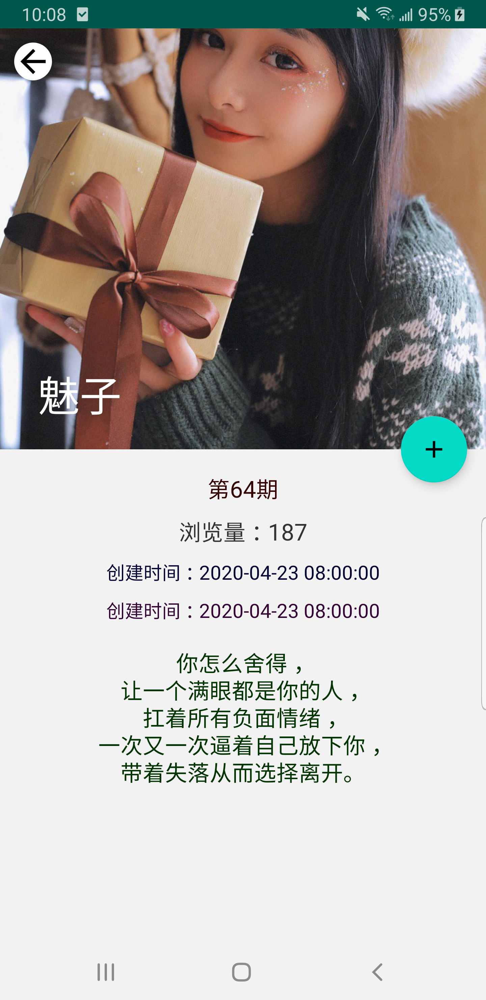
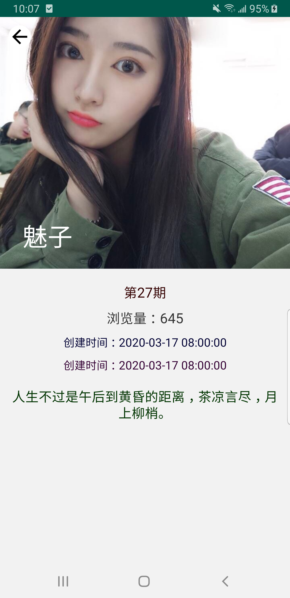

#gankMeizi

项目说明
-------
本项目是对android jetpack 的又一次尝试，项目的数据来源于干货集中营 
https://gank.io/api 妹子集合数据
采用了viewpager2,room ,viewModel,LiveData,WorkManager, Lifecycle,DataBinding 等技术
实现了列表数据，妹子收藏等功能，

jetpack
-------
\

Screenshots
-----------

第三方依赖
----------
*   

  

